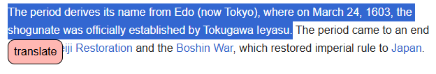
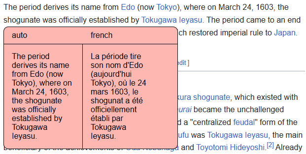

# maxtranslator

## About
This is a chrome extension to translate any text online.

## Requirement
1. Docker to run the server locally

## Installation
1. Run the server that will handle the translation.
   1. Go to LibreTranslate-main and run the script ``run.sh`` for linux or ``run.bat`` for windows.
   2. The server should run on port 5000
2. Install the extension
   1. Run ``npm i`` to install dependencies.
   2. Open chrome and go to ``chrome://extensions/``
   3. Click on ``load extension`` button and open the maxtranlator-extension folder.
   4. 

## How to use
1. Underline text.
2. Click on the translation icon that appear.
3. The translation is display.

## TODO
1. Refactor index.ts to separate icon view
2. Add global css variable for primary and secondary colors
3. Add lang selection !
4. Better UI maybe ?